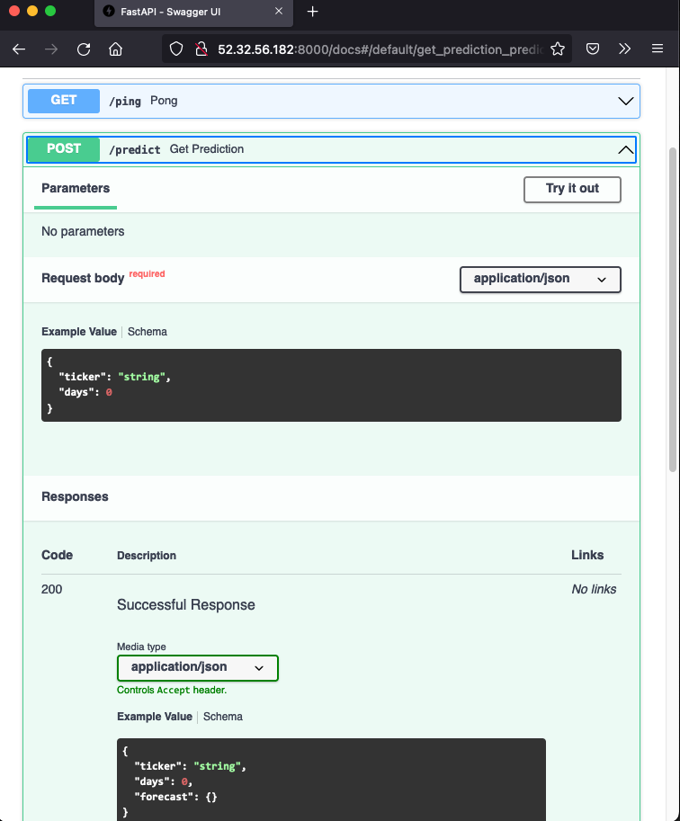

# 1. Project Setup
1. Create a new repository `stock-predictor` on GitHub; make sure to include:
    - `README.md`, with a title and short description of the project
    - .gitignore using `Python` template
    - MIT license
    
2. Create a new virtual environment for this project:
    
    `conda create -n stock-predictor python=3.9.16`
    
3. Activate the virtual environment to start the development process

	 `conda activate stock-predictor`
	 
	 1. Install the following dependencies:

	    `pip install -U -q fastapi uvicorn` 
	    

	 2. Clone the repo to your local machine 
	
    
   
4. Create a file `main.py` for our app in the `src` folder. Inside the file, create a new instance of `FastAPI` and set up a quick test route

    ```python
    from fastapi import FastAPI
    app = FastAPI()

    @app.get("/ping")
    def pong():
        return {"ping": "pong!"}
    ```
5. Launch the app in the shell (from `src`) and test the route using the command:
    
    `uvicorn main:app --reload --workers 1 --host 0.0.0.0 --port 8000`

    Below is the explanation of the command:
    - `--reload` enables auto-reload so the server will restart after changes are made to the code base.
    - `--workers 1` provides a single worker process.
    - `--host 0.0.0.0` defines the address to host the server on.
    - `--port 8000` defines the port to host the server on.
    - `main:app` tells `uvicorn` where it can find the `FastAPI` ASGI application. In this case, within the `main.py` file, you will find the ASGI app `app = FastAPI()`.

6. Navigate to http://localhost:8000/ping in your browser. You should see:

    ```json
    {
        "ping": "pong!"
    }
    ```

# 2. Time series model

We will use [Prophet](https://facebook.github.io/prophet/) to predict stock market prices. 

1. Install the dependencies:
    - Basic data manipulation and plotting: `pandas matplotlib plotly`
    - Data and modeling: `yfinance pystan prophet joblib`

2. Create a new file `model.py` in `src` folder and add the following code to train the model and generate a prediction:


```python
import datetime
from pathlib import Path
from typing import Optional, List, Dict


import joblib
import pandas as pd
import yfinance as yf
from prophet import Prophet

import argparse

BASE_DIR = Path(__file__).resolve(strict=True).parent
MODEL_DIR = Path(BASE_DIR).joinpath("models")
FIG_DIR = Path(BASE_DIR).joinpath("figures")
TODAY = datetime.date.today()


def train(ticker: str="MSFT") -> None:
    """
    Downloads historical data from Yahoo Finance, trains a Prophet model, and saves it using joblib.

    Args:
        ticker (str): Ticker symbol of the stock to be used for training the model. Defaults to "MSFT".

    Returns:
        None
    """
    # Download historical data
    data = yf.download(ticker, "2020-01-01", TODAY.strftime("%Y-%m-%d"))
    # Prepare data for modeling
    df_forecast = data.copy()
    df_forecast.reset_index(inplace=True)
    df_forecast["ds"] = df_forecast["Date"]
    df_forecast["y"] = df_forecast["Adj Close"]
    df_forecast = df_forecast[["ds", "y"]]
    # Fit Prophet model
    model = Prophet()
    model.fit(df_forecast)
    # Save trained model
    joblib.dump(model, Path(MODEL_DIR).joinpath(f"{ticker}.joblib"))


def predict(ticker: str="MSFT", days: int=7) -> Optional[List[Dict[str, float]]]:
    """
    Predict the stock price of a given ticker using the trained Prophet model.

    Parameters
    ----------
    ticker : str, optional
        Ticker symbol of the stock to predict. Default is "MSFT".
    days : int, optional
        Number of days to forecast. Default is 7.

    Returns
    -------
    Optional[List[Dict[str, float]]]
        If the model file exists, returns a list of dictionaries with the predicted dates and prices for the next `days`.
        Otherwise, returns `None`.

    """
    model_file = Path(MODEL_DIR).joinpath(f"{ticker}.joblib")
    if not model_file.exists():
        return False

    model = joblib.load(model_file)

    future = TODAY + datetime.timedelta(days=days)

    dates = pd.date_range(start="2020-01-01", end=future.strftime("%m/%d/%Y"),)
    df = pd.DataFrame({"ds": dates})

    forecast = model.predict(df)
   
    model.plot(forecast).savefig(
        Path(FIG_DIR).joinpath(f"{ticker}_plot.png"))
    model.plot_components(forecast).savefig(
        Path(FIG_DIR).joinpath(f"{ticker}_plot_components.png"))
    
    return forecast.tail(days).to_dict("records")

def convert(prediction_list: List[Dict[str, float]]) -> Dict[str, float]:
    """
    Convert the list of dictionaries returned by the `predict` function to a dictionary with dates as keys and predicted prices as values.

    Parameters
    ----------
    prediction_list : List[Dict[str, float]]
        A list of dictionaries with predicted dates and prices.

    Returns
    -------
    Dict[str, float]
        A dictionary with dates as keys and predicted prices as values.

    """    
    output = {}
    for data in prediction_list:
        date = data["ds"].strftime("%m/%d/%Y")
        output[date] = data["trend"]
    return output


if __name__ == "__main__":
    parser = argparse.ArgumentParser(description='Predict')
    parser.add_argument('--ticker', type=str, default='MSFT', help='Stock Ticker')
    parser.add_argument('--days', type=int, default=7, help='Number of days to predict')
    args = parser.parse_args()
    
    train(args.ticker)
    prediction_list = predict(ticker=args.ticker, days=args.days)
    output = convert(prediction_list)
    print(output)
```


Here we defined three functions (this model was developed by [Andrew Clark](https://twitter.com/aclarkdata1)):

- `train` downloads historical stock data with [`yfinance`](https://github.com/ranaroussi/yfinance), creates a new Prophet model, fits the model to the stock data, and then serializes and saves the model as a [`Joblib file`](https://joblib.readthedocs.io/en/latest/generated/joblib.dump.html).

- `predict` loads and deserializes the saved model, generates a new forecast, creates images of the forecast plot and forecast components, and returns the days included in the forecast as a list of dicts.

- `convert` takes the list of dicts from `predict` and outputs a dict of dates and forecasted values; e.g., `{"07/02/2020": 200}`).

-  The last block of code allows you to execute the model from the command line, with two arguments, a valid stock ticker and the number of days to predict. 

3. To see the results, in a shell, run:
    
    `python model.py`

    Output shall looks similar to the following (the output was generated on Apr 18, 2023)

```
[*********************100%***********************]  1 of 1 completed
19:21:22 - cmdstanpy - INFO - Chain [1] start processing
19:21:22 - cmdstanpy - INFO - Chain [1] done processing
{'04/19/2023': 265.7623280153823, '04/20/2023': 265.8708547944026, '04/21/2023': 265.97938157342287, '04/22/2023': 266.08790835244315, '04/23/2023': 266.1964351314634, '04/24/2023': 266.3049619104837, '04/25/2023': 266.41348868950394}    
```
or more readable as follows:

    ```
    {
        04/19/2023': 265.7623280153823, 
        '04/20/2023': 265.8708547944026, 
        '04/21/2023': 265.97938157342287, 
        '04/22/2023': 266.08790835244315, 
        '04/23/2023': 266.1964351314634, 
        '04/24/2023': 266.3049619104837, 
        '04/25/2023': 266.41348868950394
    }
    ```
    
    
These are the predicted prices for the next 7 days for the Microsoft stock (ticker: MSFT).

Note that running the above command saves `MSFT.joblib` model along with two images

<p align="center">


</p>

4. You can make more models, e.g.,
    ```
    python model.py --ticker AAPL --days 7
    python model.py --ticker GOOG --days 7
    ```

5. Push your changes as you go, as long as there are no errors.

# 3. Routes

In this part, we will wire up our API. 

1. Add a `/predict` endpoint by updating `main.py`:

```python
from fastapi import FastAPI, Query, HTTPException
from pydantic import BaseModel
from model import predict, convert

app = FastAPI()

@app.get("/ping")
def pong():
    return {"ping": "pong!"}
# pydantic models
class StockIn(BaseModel):
    ticker: str
    days: int

class StockOut(StockIn):
    forecast: dict

@app.post("/predict", response_model=StockOut, status_code=200)
def get_prediction(payload: StockIn):
    ticker = payload.ticker
    days = payload.days

    prediction_list = predict(ticker, days)

    if not prediction_list:
        raise HTTPException(status_code=400, detail="Model not found.")

    response_object = {
        "ticker": ticker, 
        "days": days,
        "forecast": convert(prediction_list)}
    return response_object

```

So, in the new function `get_prediction`, we passed in a ticker to our model's `predict` and then used `convert` to create the output for the response object. We also took advantage of a `pydantic` [schema](https://pydantic-docs.helpmanual.io/usage/schema/) to covert the JSON payload to a `StockIn` object schema. This provides automatic type validation. The response object uses the `StockOut` schema object to convert the Python `dict` - `{"ticker": ticker, "days": days, "forecast": convert(prediction_list)}` - to JSON, which, again, is validated.

2. Disable plotting for the web app.
Let's just output the forecast in JSON. Comment out the following lines in `predict` in `model.py`:

    ```python
    """
    model.plot(forecast).savefig(
        Path(FIG_DIR).joinpath(f"{ticker}_plot.png"))
    model.plot_components(forecast).savefig(
        Path(FIG_DIR).joinpath(f"{ticker}_plot_components.png"))    
    """    
    ```

    Optional. Comment out or remove the `if name == __main__` block in `model.py`.

3. Run the app locally.

    ```uvicorn main:app --reload --workers 1 --host 0.0.0.0 --port 8000```

4. Test the endpoint. Open a new shell, use `curl` to test the endpoint:
    ```
    curl \
    --header "Content-Type: application/json" \
    --request POST \
    --data '{"ticker":"MSFT", "days":7}' \
    http://0.0.0.0:8000/predict
    ```

    You shall see something like:
    ```python
    {
    	"ticker":"MSFT",
    	"days":7,
    	"forecast"{ 
    		"04/19/2023":265.7623280153823,
			"04/20/2023":265.8708547944026,
			"04/21/2023":265.97938157342287,
			"04/22/2023":266.08790835244315,
			"04/23/2023":266.1964351314634,
			"04/24/2023":266.3049619104837,
			"04/25/2023":266.41348868950394
			}
		}
    ```

5. Try it with a different ticker. If the input ticker doesn't have a trained model or the ticker is not valid, you will get this error:

```
{"detail":"Model not found."}
```

6. Navigate to `http://127.0.0.1:8000/docs` (or `http://localhost:8000/docs`) and see the interactive API documentation.

7. Generate requirements file for your working app in a shell:
    ```
    pip list --format=freeze > requirements.txt
    ```
8. Commit and push your work. 
	
	<details> 
	<summary> Click here to see a sample structure of the repository </summary>
	
	You can see the structure of your folder by running `tree -L 2` on the root folder of your project.
		
	```
	├── LICENSE
	├── README.md
	├── __pycache__
	│   ├── main.cpython-39.pyc
	│   └── model.cpython-39.pyc
	├── figures
	│   ├── AAPL_plot.png
	│   ├── AAPL_plot_components.png
	│   ├── GOOG_plot.png
	│   ├── GOOG_plot_components.png
	│   ├── MSFT_plot.png
	│   └── MSFT_plot_components.png
	├── models
	│   ├── AAPL.joblib
	│   ├── GOOG.joblib
	│   └── MSFT.joblib
	├── requirements.txt
	└── src
	├── __pycache__
	├── main.py
	└── model.py
	```
	</details>


# 4. AWS Deployment
1. Create your EC2 instance in the AWS management tool. The UI is straightforward and for most settings, use the default. Refer to the [tutorial](https://docs.aws.amazon.com/AWSEC2/latest/UserGuide/EC2_GetStarted.html#ec2-launch-instance) for more information. Note:

    - Use `stock-predictor-fastapi` for the **Key pair name** when generating the `pem` file.

    - In Step 1-7 **Network Setting**: click `Edit` and make sure you have two (or three) security group rules. One has the type SSH with port 22, and another TCP port for the API, e.g., `8000`, edit the source and also add port 5000 and 8000. See the bottom of the screenshot below for reference. 
        <p align="center">
        
        </p>

2. Once you launch the instance, it should take ~30 seconds to start. Click into your instance. Refresh to see the `Connect` button is no longer grayed out, and click `Connect`. 

3. In the `Connect to instance` tab, find `SSH client`. Move the `stock-predictor-fastapi.pem` file you downloaded earlier to your local repo. Follow the instruction, change the permissions:
    ```
    chmod 400 stock-predictor-fastapi.pem
    ```
4. Update file `.gitignore` to include the `pem` file, and push all your working code to the repository. **NEVER** push your secret keys to the repository.

5. Access the EC2 Instance using ssh. In the same `Connect to instance` tab, you can find the command to access the instance via ssh, something like:

    `ssh -i "stock-predictor-fastapi.pem" ec2-user@ec2-35-90-247-255.us-west-2.compute.amazonaws.com`

    Run the command where `stock-predictor-fastapi.pem` is located.  
    
6. If you see something similar to the following, then congratulations! you are in the right place:

    ```
    (stock-predictor) ☁  stock-predictor [main] ssh -i "stock-predictor-fastapi.pem" ec2-user@ec2-35-90-247-255.us-west-2.compute.amazonaws.com
    Last login: Tue Jul 19 21:58:43 2022 from 47.157.165.203

        __|  __|_  )
        _|  (     /   Amazon Linux 2 AMI
        ___|\___|___|

    https://aws.amazon.com/amazon-linux-2/
    [ec2-user@ip-172-31-24-66 ~]$ 
    ```

7. Set up environment

    ```
    sudo yum update -y 
    sudo yum install git -y  # install git

    # install tmux to switch easily between programs in one terminal
    sudo yum install tmux

    # install miniconda and add its path to env
    wget https://repo.continuum.io/miniconda/Miniconda3-latest-Linux-x86_64.sh -O ~/miniconda.sh
    bash ~/miniconda.sh -b -p ~/miniconda
    echo "PATH=$PATH:$HOME/miniconda/bin" >> ~/.bashrc
    source ~/.bashrc
    ```
    
8. Clone the repository (use https for convenience) and install all dependencies:
 
    ```
    git clone https://github.com/[YOUR HANDLER]/stock-predictor.git
    cd stock-predictor
    pip install -U pip
    pip install -r requirements.txt
    
    ```
9. Before launching the app, we can avoid ssh time out using `tmux` to create a new session. 
    ```
    tmux new -s stock_session
    ```
    If you skip this step, the app will be closed after you exit the ssh session.
    
10. Navigate to the same directory where `main.py` is (e.g., repo root directory or `src`) and run the app

    ```
    uvicorn main:app --reload --workers 1 --host 0.0.0.0 --port 8000
    ```

    The shell looks like this:
    ```
    [ec2-user@ip-172-31-24-66 src]$ uvicorn main:app --reload --workers 1 --host 0.0.0.0 --port 8000                                                  
    INFO:     Will watch for changes in these directories: ['/home/ec2-user/stock-predictor/src']
    INFO:     Uvicorn running on http://0.0.0.0:8000 (Press CTRL+C to quit)
    INFO:     Started reloader process [9693] using StatReload
    INFO:     Started server process [9695]
    INFO:     Waiting for application startup.
    INFO:     Application startup complete.
    ```
    
11. Now find the Public IPv4 address for your instance, e.g., 52.32.56.182, and run the following in another shell on your local machine:

    ```
    curl \
    --header "Content-Type: application/json" \
    --request POST \
    --data '{"ticker":"MSFT", "days":7}' \
    http://52.32.56.182:8000/predict
    ```

    You shall see the predictions 🎉🎉🎉


12. Final step: detach `tmux` session so that it continues running in the background when you leave ssh shell. Press `Ctrl`+`b`, release, then press `d` (NOT `Ctrl`, `b`, and `d` together). Then you can leave the ssh shell and the app will continue running.

    You can attach the session by running `tmux attach -t stock_session`.

13. You shall be able to access the API documentation and share it with others. Use the Public IP address for your EC2 instance, e.g., `http://52.32.56.182:8000/docs`. 

    <details>
    <summary> Screenshots of the docs.
    </summary>

    Click `Try it out` to make predictions interactively.

    <p align="center">
    
    
    </p>
    </details>

# 5 Dockerize

In this section, we build a container image for our app, using Docker. 

## Step 1: Prep

1. Start a new feature branch for your project, name it `container`.

    ``` git checkout -b container ```

2. Install [Docker](https://docs.docker.com/get-docker/) if you have not done so yet and launch Docker. 

    You can verify the installation by running the following command:

    ``` docker --version ```

    If you see something like `Docker version 20.10.24, build 297e128`, you have successfully installed Docker.

3. Create a `.dockerignore` file in your project directory.

    ``` echo "__pycache__\nenv\n.pem" > .dockerignore ```
    
    
## Step 2: Dockerfile

1. Create a new file `Dockerfile` in the repo and follow these steps to complete `Dockerfile`.

    ``` touch Dockerfile # or vi Dockerfile ```
    
2. Start from the official Python base image in your `Dockerfile`.
    ```
    FROM python:3.9.16
    ```
3. Set the working directory to the `/code` of your project inside the container.
    ```
    WORKDIR /code
    ```
4. Install appropriate dependencies.
    ```
    RUN apt-get -y update  && apt-get install -y \
        python3-dev \
        apt-utils \
        python-dev \
        build-essential \   
    && rm -rf /var/lib/apt/lists/* 
    ```
5. Install `pystan` (later when building the image, you will see this step takes a long time). 

    `prophet` requires that `pystan` be installed. And `pystan` is bit tricky to install; we need to install `cython` and `numpy` first.

    ```
    RUN pip install --no-cache-dir -U pip
    RUN pip install --no-cache-dir -U cython
    RUN pip install --no-cache-dir -U numpy
    RUN pip install --no-cache-dir -U pystan
    ```

6. Copy the file with the requirements to `/code` directory.

    ```
    COPY ./requirements.txt /code/requirements.txt
    RUN pip install --no-cache-dir -U -r  /code/requirements.txt
    ```
    * To avoid errors related to different OS environments during installation, you can edit the requirements file to the following:
    
	```
	fastapi 
	uvicorn
	pandas
	yfinance
	prophet
	joblib
	argparse
	```

	* If you commented out the code snippet that starts with `if __name__ == "__main__":` in your `main.py`, you might as well remove argparse from your requirements file. 
	
7. Copy everything under `src/` and `model/` directory inside the respective directory under `code`

	```
	COPY ./src/ /code/src
	COPY ./models/ /code/models
	```

    As this has all the code which is what changes most frequently the Docker cache won't be used for this or any following steps easily.

    So, it's important to put this near the end of the Dockerfile, to optimize the container image build times. 
    
    Make sure you have `main.py`, `model.py` in `src` and the model files `.joblib` in `models` folders. 

    Read [Docker Cache](https://fastapi.tiangolo.com/deployment/docker/#docker-cache) for more information.
    


8. Lastly, Set the command to run the `uvicorn` server.

    `CMD` takes a list of strings, each of these strings is what you would type in the command line separated by spaces.

    This command will be run from the **current working directory**, the same `/code` directory you set above with `WORKDIR /code`.
    
    * Since `main.py` is run from `src` and inside it we import from `model`, we need to add this folder to the `PYTHONPATH`:
    
    `ENV PYTHONPATH /code/src`

    Because the program will be started at `/code` and inside of it are your scripts and models, `uvicorn` will be able to see and import `app` from `src.main`.
    
    ```
    CMD ["uvicorn", "src.main:app", "--host", "0.0.0.0", "--port", "8000"]
	```

## Step 3. Build the Docker Image
1. Build the container image: 
    
    `docker build -t stock-prophet .`

    <details>
    <summary> Click here to see sample output </summary>
    
    Notice that step 6/10 took the longest to build.
    ```
    [+] Building 669.2s (14/14) FINISHED                                                                
    => [internal] load build definition from Dockerfile                                           0.0s
    => => transferring dockerfile: 519B                                                           0.0s
    => [internal] load .dockerignore                                                              0.0s
    => => transferring context: 34B                                                               0.0s
    => [internal] load metadata for docker.io/library/python:3.8                                  0.5s
    => [ 1/10] FROM docker.io/library/python:3.8@sha256:7d870123fe736cc912528a4f29c380d19f5efa29  0.0s
    => [internal] load build context                                                              0.0s
    => => transferring context: 1.22kB                                                            0.0s
    => CACHED [ 2/10] RUN apt-get -y update && apt-get install -y   python3-dev   apt-utils   py  0.0s
    => CACHED [ 3/10] RUN pip install --no-cache-dir -U pip                                       0.0s
    => [ 4/10] RUN pip install --no-cache-dir -U cython                                           1.5s
    => [ 5/10] RUN pip install --no-cache-dir -U numpy                                            3.7s
    => [ 6/10] RUN pip install --no-cache-dir -U pystan                                         529.6s 
    => [ 7/10] COPY requirements.txt .                                                            0.0s 
    => [ 8/10] RUN pip install --no-cache-dir -U -r requirements.txt                            129.4s 
    => [ 9/10] COPY src/ .                                                                        0.1s 
    => exporting to image                                                                         4.3s 
    => => exporting layers                                                                        4.3s 
    => => writing image sha256:44e99ee39267bc9c9b65e44a67e1cd534bf98f8e0f4c469c9a617e4be8636640   0.0s 
    => => naming to docker.io/library/stock-prophet                                               0.0s 
    ```
    </details>

2. Verify that the image has been built.

    ```docker image ls # docker images```    

    You shall see something similar to this:
    
    ```
    REPOSITORY        TAG       IMAGE ID       CREATED        SIZE
    stock-prophet     latest    44e99ee39267   1 minute ago   1.78GB
    hello-world       latest    46331d942d63   4 months ago   9.14kB
    ```

    See more images management commands [here](https://docs.docker.com/engine/reference/commandline/image/).
`docker history --no-trunc IMAGE_ID`

## Step 4: Start Docker Container

1. Before you start the container, verify that nothing is running on your localhost.

    ```curl localhost:8000```

    You shall see the following response:
    
    ```
    curl: (7) Failed to connect to localhost port 8000: Connection refused
    ```
2. Alternatively, list all the running containers:
    
    ```docker ps -a # or simply "docker ps"```
    
    You shall see something similar to this:
    
    ```
    CONTAINER ID        IMAGE               COMMAND                  CREATED             STATUS              PORTS               NAMES
    ```
3. Start the container
    ```
    docker run -d --name mycontainer -p 8000:8000 stock-prophet
    ```
4. Verify that the container is running:
    
    ```docker ps -a```

    <details><summary> Expected output </summary>
    
    ```
    CONTAINER ID   IMAGE           COMMAND                  CREATED          STATUS          PORTS                    NAMES
    725a7ee73273   stock-prophet   "uvicorn main:app --…"   30 seconds ago   Up 29 seconds   0.0.0.0:8000->8000/tcp   mycontainer
    ```
    </details>

5. Now the app should be running on port 8000.
    
    ```curl localhost:8000/ping```
    
    You shall see the following response:
    
    ```
    {"ping":"pong!"}
    ```

    or getting predictions:
    
    ```
    curl \
    --header "Content-Type: application/json" \
    --request POST \
    --data '{"ticker":"MSFT", "days":7}' \
    http://localhost:8000/predict
    ```

    That's it, you just successfully built a Docker container for your FastAPI app! 

6. Stop the container:
    
    ```docker stop mycontainer```
    
    You shall see the following response:
    
    ```
    Stopped container mycontainer
    ```
    
7. Commit and push your changes to the `container` branch and merge the branch to the `main` branch.      
    