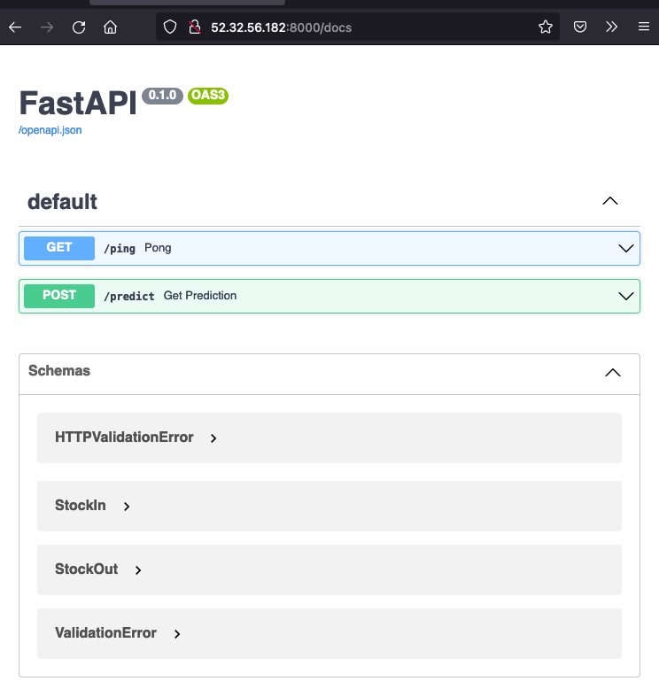
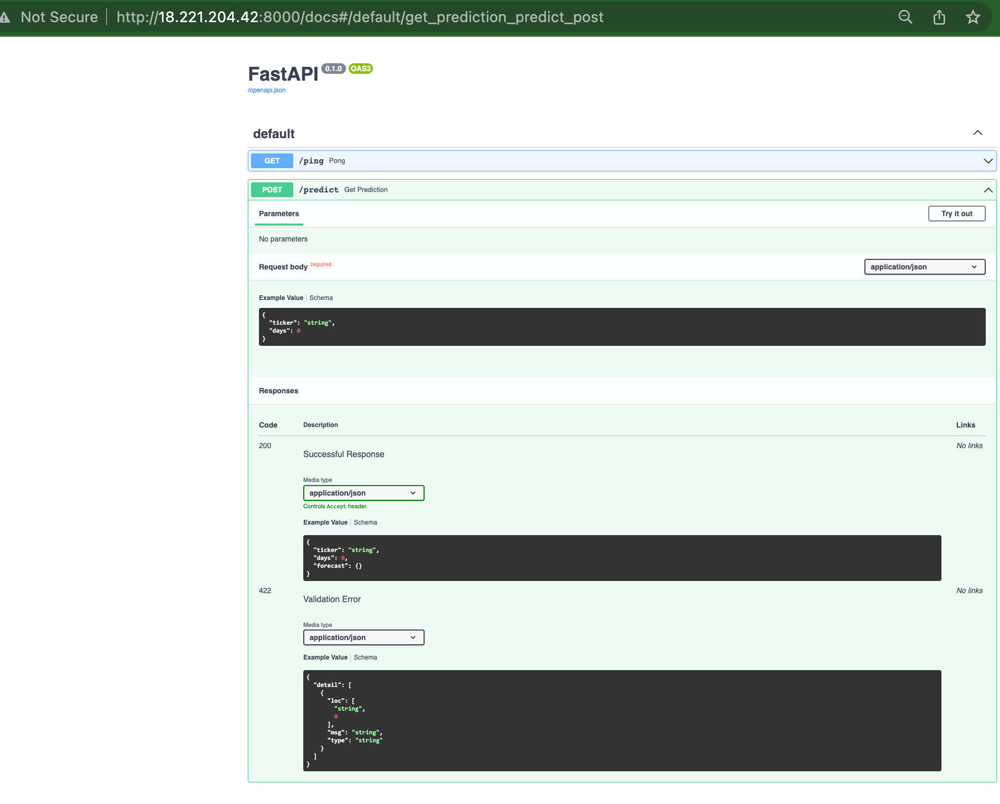

# stock-predictor

The instruction for creating this API is found on my [FourthBrain repo](https://github.com/AsiehH/MLE-7/tree/main/assignments/week-11-intro-mlops/stock-predictor)

To get predictions from the API, run the following command from a terminal window on your local machine. The IP@ is the public IPV4 of your EC2 instance. 

    ```
    curl \
    --header "Content-Type: application/json" \
    --request POST \
    --data '{"ticker":"MSFT", "days":7}' \
    http://52.32.56.182:8000/predict
    ```
    
Alternatively, you can access the API documentaiton by using your public IPV4 on this url: 
**http://52.32.56.182:8000/docs** 

Result example:    

<p align="center">



</p>
    
    
